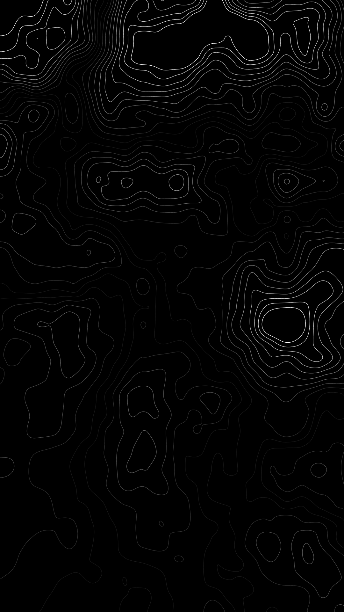

# Marching Squares

A Python tool that generates animated topographic-style contour art using the Marching Squares algorithm.

A scalar field is generated either from a **mixture of Gaussians** or **Perlin noise** (multi-layer, with configurable frequency growth). The Marching Squares algorithm then traces isolines at multiple threshold levels across the field, and the result is rendered as a colored line collection with matplotlib.

The main output is an animated MP4/GIF where the field smoothly morphs over time — by interpolating Gaussian coefficients, covariance matrices, or Perlin gradient grids between two random states using a cosine schedule.

## Stack
Python · NumPy · PyTorch · matplotlib · imageio · moviepy
